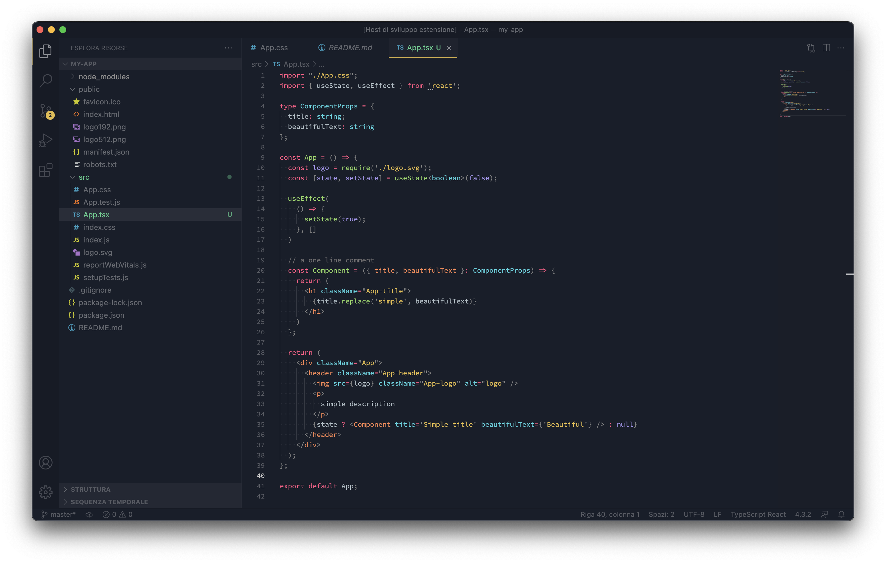

# Monokai Universe

This is a beautiful theme :D

# Screenshot

# Palette

  

    

      

      #191E29
    

    

      

      #DBB952
    

    

      

      #E84F76
    

    

      

      #97CC66
    

    

      

      #E68657
    

    

      

      #65CAD7
    

    

      

      #9689E1
    

    

      

      #FFFFFF
    

  

  

    

      

      #1C212C
    

    

      

      #1F232E
    

    

      

      #242833
    

    

      

      #292D38
    

    

      

      #333741
    

    

      

      #3D404A
    

    

      

      #464952
    

    

      

      #575A62
    

  

  

    

      

      #666970
    

    

      

      #74777D
    

    

      

      #818389
    

    

      

      #8C8E94
    

    

      

      #C4C5C8
    

    

      

      #C9CACD
    

    

      

      #CECFD2
    

    

      

      #D2D3D6
    

  

